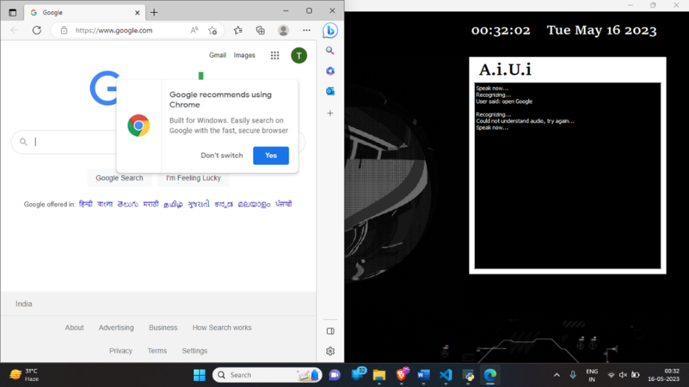
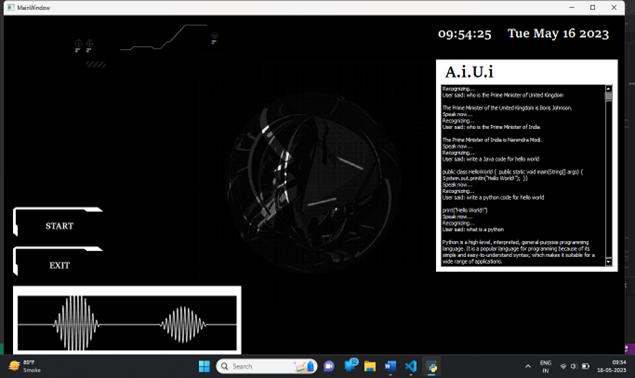
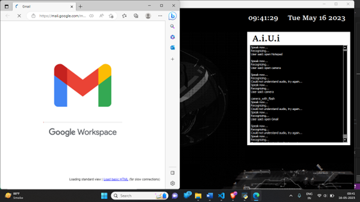
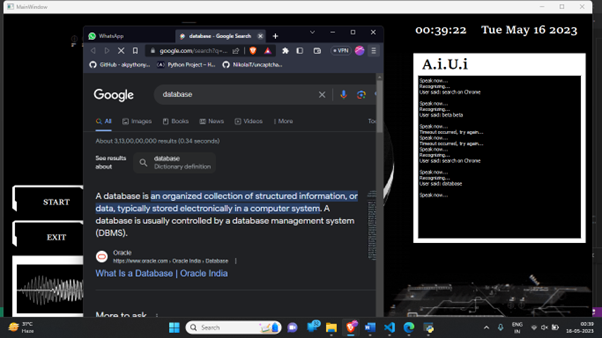
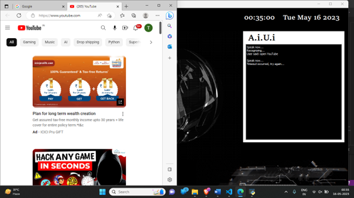

# A.i.U.i - Artificial Intelligence User Interface

A.i.U.i is a futuristic Desktop Voice Assistant application built with Python and PyQt5. It acts as a personal assistant that can perform various tasks on your computer, answer questions, and automate web interactions, all through voice commands.

## 🚀 Features

- **Voice Interaction**: Listens to commands and responds with voice output.
- **AI Chat**: Integrated with OpenAI (GPT-3) for natural conversations.
- **Web Automation**: Opens websites like YouTube, Google, Netflix, Amazon, Flipkart, etc.
- **System Control**:
    - Open system applications (Camera, Notepad, Command Prompt).
    - Shutdown or Restart the computer.
- **Information Retrieval**:
    - Real-time Weather updates (via OpenWeatherMap).
    - Latest News headlines (via NewsAPI).
    - Trending Movies (via TMDB).
    - Wikipedia summaries.
- **Communication**:
    - Send Emails.
    - Open WhatsApp, Instagram, Twitter, Facebook, LinkedIn.
- **GUI**: A modern, dark-themed interface with animated GIFs and real-time date/time display.

## 📸 Screenshots

<p align="center">
  
  
  
  
  
</p>

## 🛠️ Tech Stack

- **Language**: Python 3
- **GUI Framework**: PyQt5
- **Voice Recognition**: `speech_recognition`
- **Text-to-Speech**: `pyttsx3`
- **APIs**:
    - OpenAI API
    - OpenWeatherMap API
    - NewsAPI
    - TMDB API

## 📦 Installation

1.  **Clone the repository**:
    ```bash
    git clone https://github.com/yourusername/AiUi.git
    cd AiUi
    ```

2.  **Install Dependencies**:
    You need to install the required Python libraries. You can do this via pip:
    ```bash
    pip install PyQt5 pyttsx3 speechrecognition wikipedia requests psutil openai
    ```
    *Note: You may also need `pyaudio` for microphone input. If pip install fails, try downloading the wheel file for your version of Python.*

### ⚡ Quick Start (Windows)

For an easy setup, we have provided batch scripts:

1.  **Install Dependencies**: Double-click `setup.bat`.
2.  **Run Application**: Double-click `run.bat`.

3.  **Setup API Keys**:
    **Important**: This project requires API keys to function fully.
    - Open `main5.py`.
    - Replace the placeholder API keys with your own:
        - `weather_api_key` (OpenWeatherMap)
        - `openai.api_key` (OpenAI)
        - `NEWS_API_KEY` (NewsAPI)
        - `TMDB_API_KEY` (The Movie Database)
    - For Email features, update the `sendEmail` function with your credentials (use App Passwords for security).

## 🎮 Usage

1.  Run the application:
    ```bash
    python cAiUi.py
    ```
    *Or simply run `run.bat`.*

2.  Click the **START** button on the GUI.
3.  The assistant will initialize and greet you.
4.  Speak your commands! (e.g., "Open Google", "What is the weather in London?", "Tell me a joke").

## ⚠️ Important Note on Security

**Do not commit your real API keys or passwords to GitHub.**
Before pushing this code, ensure you have removed any hardcoded credentials from `main5.py`. It is recommended to use environment variables or a separate `config.py` file listed in `.gitignore`.

## 📄 License

[MIT License](LICENSE)
